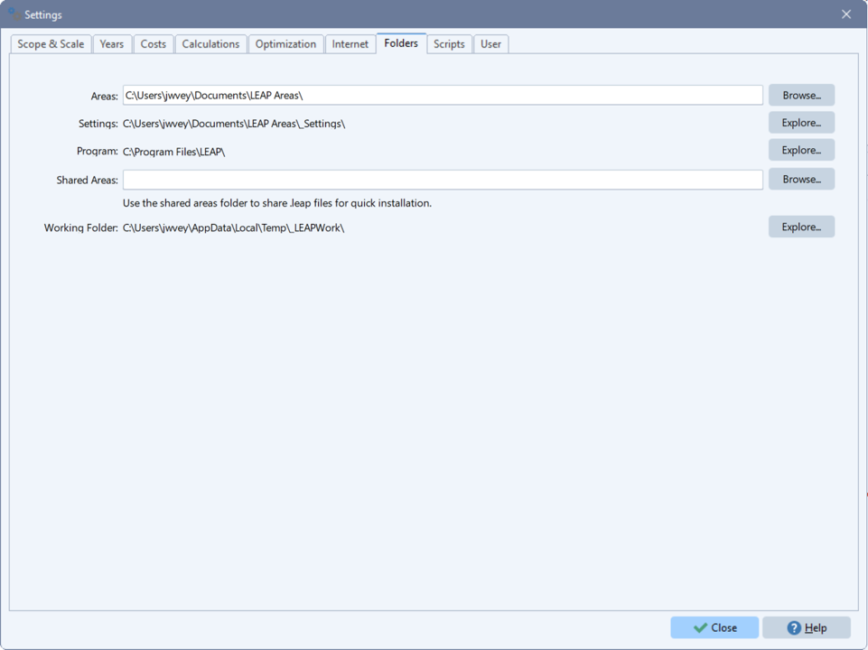

```@meta
CurrentModule = NemoMod
```
# [Configuration files](@id configuration_file)

When you calculate a scenario with NEMO, you can provide a configuration file that sets run-time options. The file should be named `nemo.toml`, `nemo.ini`, or `nemo.cfg` and should be available in Julia's working directory. To check the working directory in a Julia session, use the `pwd` function. To change the working directory, use `cd`.

NEMO configuration files are text files written in [TOML syntax](https://toml.io/). 

!!! note
    Prior to NEMO 2.3, NEMO configuration files were written in `ini` syntax, not TOML. If you have a legacy `ini` configuration file, you can convert it to TOML using NEMO's [`convert_ini_to_toml`](@ref) function.

Run-time options in a configuration file are sorted into three blocks as described below.

## `[calculatescenarioargs]` block

This block defines options that affect the behavior of [`calculatescenario`](@ref). The available options are listed below.

### `jumpdirectmode`

Indicates whether JuMP's direct mode should be used in the scenario calculation. Direct mode bypasses some JuMP features that help to ensure compatibility with a wide range of solvers. These include reformulating (or bridging) the constraints, variables, and optimization objective that NEMO defines as needed to promote cross-solver compatibility. When direct mode is invoked, scenario calculation is generally faster and requires less memory; however, it can result in a solver error in some cases. If this option is set in a configuration file, it overrides the selection of direct mode in the JuMP `Model` object passed to `calculatescenario` (via the `jumpmodel` argument). If `jumpmodel` does not align with `jumpdirectmode`, NEMO resets `jumpmodel` to activate/deactivate direct mode accordingly. This process restores model attributes (except for the choice of solver) and solver parameters to their default values. To ensure solver parameters are retained, specify them in the `solver` block of the configuration file. For more information on direct mode, see the [JuMP documentation](https://jump.dev/JuMP.jl/stable/).

**Type:** TOML Boolean

**Example:** `jumpdirectmode = true`

### `jumpbridges`

Indicates whether JuMP's bridging features should be used in the scenario calculation (ignored if `jumpdirectmode` is `true`, as this implies bridging is disabled). Bridging involves reformulating the constraints, variables, and optimization objective that NEMO defines as needed to promote cross-solver compatibility. When bridging is disabled, scenario calculation is generally faster and requires less memory; however, it can result in a solver error in some cases. If this option is set in a configuration file, it overrides the use of bridging in the JuMP `Model` object passed to `calculatescenario` (via the `jumpmodel` argument). If `jumpmodel` does not align with `jumpbridges`, NEMO resets `jumpmodel` to activate/deactivate bridging accordingly. This process has the same effects as described under `jumpdirectmode`. For more information on bridging, see the JuMP documentation.

**Type:** TOML Boolean

**Example:** `jumpbridges = false`

### `calcyears`

[`Years`](@ref year) to include in the scenario calculation (should be a subset of the years defined in the [scenario database](@ref scenario_db); other years are ignored). As with the corresponding argument for `calculatescenario`, this option allows you to control whether NEMO performs [perfect foresight or limited foresight optimization](@ref foresight). The option should be specified as an array of arrays of years - e.g., `[[2025,2027],[2030,2032]]`. Each inner array is a group of years that NEMO optimizes with perfect foresight; the years in a group can be sparse, allowing you to [calculate selected years](@ref selected_years) only for a group. When NEMO runs the scenario calculation, it proceeds through groups of years in the order given in the outer array, optimizing each and using its results as the starting point for the next group of years. Thus, if multiple groups are defined in the outer array, NEMO performs a limited foresight optimization. If more than one group of years is specified, the groups should be in chronological order and should not overlap. If this option is set in a configuration file, it overrides the `calcyears` argument for `calculatescenario`.

**Type:** TOML array of arrays of years

**Examples**

`calcyears = [[2025,2027],[2030,2032]]` - Optimize 2025 and 2027 with perfect foresight; then optimize 2030 and 2032 with perfect foresight, using the results from 2025 and 2027 as a starting point.

`calcyears = [[2026,2027,2028,2029,2030,2031,2032,2033,2034,2035]]` - Optimize 2026-20235 with perfect foresight.

### `varstosave`

List of output [variables](@ref variables) (Julia variable names) whose values should be saved in the scenario database at the end of the calculation. NEMO adds variables specified in a configuration file to those requested in the `varstosave` argument for `calculatescenario`.

**Type:** TOML array of strings

**Example:** `varstosave = ["vtransmissionannual", "vtransmissionbuilt", "vtransmissionbyline", "vtransmissionexists", "vtotalcapacityannual", "vtradeannual"]`

### `restrictvars`

Indicates whether NEMO should conduct additional data analysis to limit the set of variables created in the optimization problem for the scenario. By default, to improve performance, NEMO selectively creates certain variables to avoid combinations of subscripts that do not exist in the scenario's data. This option increases the stringency of this filtering. It requires more processing time as the model is built, but it can substantially reduce the solve time for large models. If this option is specified in a configuration file, it overrides the `restrictvars` argument for `calculatescenario`.

**Type:** TOML Boolean

**Example:** `restrictvars = true`

### `reportzeros`

Indicates whether results saved in the scenario database should include values equal to zero. Forgoing zeros can substantially improve the performance of large models. If this option is specified in a configuration file, it overrides the `reportzeros` argument for `calculatescenario`.

**Type:** TOML Boolean

**Example:** `reportzeros = false`

### `continuoustransmission`

Indicates whether continuous (`true`) or binary (`false`) variables are used to represent investment decisions for candidate [transmission lines](@ref transmissionline). Continuous decision variables can decrease model run-time but may reduce the realism of transmission simulations. This option is not relevant in scenarios that do not model transmission. If it is specified in a configuration file, it overrides the `continuoustransmission` argument for `calculatescenario`.

**Type:** TOML Boolean

**Example:** `continuoustransmission = true`

### `forcemip`

Indicates whether NEMO is forced to formulate a mixed-integer optimization problem for the scenario. Activating this option can improve performance with some solvers (e.g., CPLEX, Mosek). If this option is specified in a configuration file, it overrides the `forcemip` argument for `calculatescenario`. If you do not activate `forcemip` (in a configuration file or as an argument for `calculatescenario`), the input parameters in your scenario database determine whether the optimization problem for the scenario is mixed-integer. See the note under [Solver compatibility](@ref solver_compatibility) for more information.

**Type:** TOML Boolean

**Example:** `forcemip = true`

### `startvalsdbpath`

Path to a previously calculated scenario database from which NEMO should take starting values for optimization variables. This option is used in conjunction with `startvalsvars` to warm start optimization. If it is specified in a configuration file, it overrides the `startvalsdbpath` argument for `calculatescenario`.

**Type:** TOML String

**Example:** `startvalsdbpath = "c:\\temp\\warmstart\\warm_start.sqlite"`

### `startvalsvars`

Comma-delimited list of variables (Julia variable names) for which starting values should be set. NEMO takes starting values from output variable results saved in the database identified by `startvalsdbpath`. Saved results are matched to variables in the optimization problem using the variables' subscripts, and starting values are set with JuMP's `set_start_value` function. If you don't provide a value for `startvalsvars`, NEMO sets starting values for all variables present in both the optimization problem and the `startvalsdbpath` database. If `startvalsvars` is specified in a configuration file, it overrides the `startvalsvars` argument for `calculatescenario`.

**Type:** TOML String

**Example:** `startvalsvars = "vnewcapacity,vtransmissionbuilt"`

### `precalcresultspath`

Path to a previously calculated scenario database that NEMO should copy over the database specified by the `calculatescenario` `dbpath` argument. This option can also be a directory containing previously calculated scenario databases, in which case NEMO copies any file in the directory with the same name as the `dbpath` database. If this option is activated, the copying replaces normal scenario optimization. If you set `precalcresultspath` in a configuration file, it overrides the `precalcresultspath` argument for `calculatescenario`.

**Type:** TOML String

**Example:** `precalcresultspath = "c:/temp/precalc`

### `quiet`

Indicates whether NEMO should suppress low-priority status messages (which are otherwise printed to `STDOUT`). If this option is specified in a configuration file, it overrides the `quiet` argument for `calculatescenario`.

**Type:** TOML Boolean

**Example:** `quiet = false`

!!! note
    If you're using NEMO with LEAP, be aware that some versions of LEAP set `quiet` to `true` when calling `calculatescenario`. This means you can't see NEMO's normal output, even in LEAP's log files. To reverse this behavior, add `quiet = false` to your configuration file.

## `[solver]` block

This block defines parameters that NEMO passes to the solver used in `calculatescenario`. It supports one option as shown below.

### [`parameters`](@id config_parameters)

Comma-delimited list of solver run-time parameters. Format: parameter1=value1,parameter2=value2,... NEMO includes logic to ignore parameters that don't apply to a particular solver, so if you use different solvers with your model, you can specify parameters for all of them in this option. There's no need to maintain a different version of the configuration file for each solver.

**Type:** TOML String

**Example:** `parameters = "CPXPARAM_MIP_Tolerances_MIPGap=0.05,CPXPARAM_Simplex_Perturbation_Indicator=1,NumericFocus=2,MIPGap=0.05,MIPFocus=1,Method=3"`

## `[includes]` block

This block identifies custom Julia scripts that should be executed with `calculatescenario`. The available options are listed below.

### `beforescenariocalc`

Path to a Julia script that should be run before NEMO calculates the scenario. The path should be defined relative to the Julia working directory (e.g., `./my_script.jl`).

**Type:** TOML String

**Example:** `beforescenariocalc = "./beforescenariocalc.jl"`

### `afterscenariocalc`

Path to a Julia script that should be run after NEMO calculates the scenario. The path should be defined relative to the Julia working directory (e.g., `./my_script.jl`).

**Type:** TOML String

**Example:** `afterscenariocalc = "./afterscenariocalc.jl"`

### `customconstraints`

Path to a Julia script that should be run when NEMO builds constraints for the scenario. The script can be used to add [custom constraints](@ref custom_constraints) to the model. The path should be defined relative to the Julia working directory.

**Type:** TOML String

**Example:** `customconstraints = "./customconstraints.jl"`

## Configuration file examples

Here's an example of a configuration file that sets a few of the available options.

```toml
[calculatescenarioargs]
varstosave="vnewcapacity,vtotalcapacityannual"
continuoustransmission=true

[solver]
parameters="CPX_PARAM_DEPIND=-1,CPXPARAM_LPMethod=1"  # Parameters for CPLEX solver

[includes]
beforescenariocalc="./before_scenario_script.jl"
customconstraints="c:/my path/custom_constraints.jl"
```
NEMO also comes with a sample configuration file saved at `utils/nemo.toml` in the [NEMO package directory](@ref nemo_package_directory).

## Including a configuration file in a LEAP-NEMO model

If you're running NEMO through LEAP, you can include a NEMO configuration file in your LEAP model to have it used at calculation time. Options set in the file will override or add to the NEMO options LEAP would otherwise choose (see above for details on which options override defaults and which add to them).

Here are the steps to follow:

1. Create the configuration file and name it `nemo.cfg`.
2. Close your model in LEAP.
3. Locate the LEAP areas repository on your computer. The areas repository is a folder where LEAP saves all models installed on a computer; typically, it is in your Windows user's Documents folder and is named "LEAP Areas". As of LEAP version 2020.1.0.37, you can find the path to the LEAP areas repository within LEAP by looking at Settings -> Folders -> Areas.

   

4. Copy the configuration file to your model's folder in the LEAP areas repository. This folder will have the same name as your model.
5. Open the model in LEAP and calculate a scenario that optimizes with NEMO. If the configuration file is successfully used in the calculation, you should see output in the NEMO window that indicates the file was read (unless the `quiet` argument for `calculatescenario` is true - this suppresses the output).

!!! note
    When modifying an existing NEMO configuration file in a LEAP-NEMO model, be sure to close the model in LEAP first. Otherwise your changes may not be applied correctly.